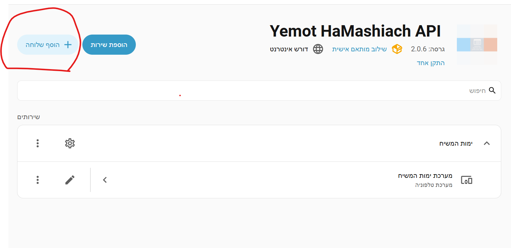
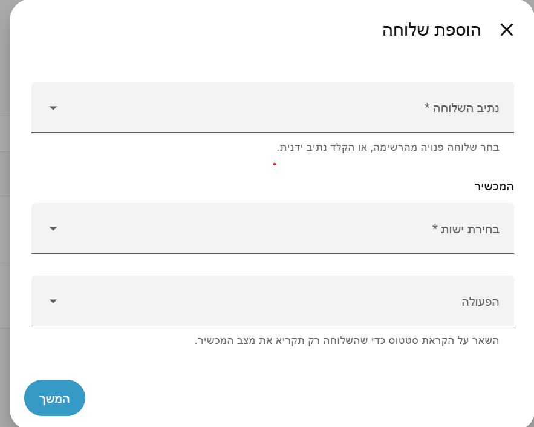

<div dir="rtl">

# ימות המשיח עבור Home Assistant


אינטגרציה המחברת את מערכת הטלפוניה וה־IVR של ימות המשיח אל הבית החכם.

מאפשרת לשמוע את מצב המכשירים בשיחת טלפון רגילה, לשלוט בהם באמצעות הקשה בשלוחה, ולשלוח צנתוקים והודעות קוליות מתוך אוטומציות. הכל בלי אינטרנט בטלפון ובלי אפליקציה.

**השלוחות מוגדרות ישירות מהממשק.** כל שלוחה מקבלת התקן משלה, עם מונה שיחות, זמן שיחה אחרונה, וחיישן שמתריע אם ההגדרה בימות השתנתה.

---
## איך זה נראה

הוספת שלוחה ישירות מכרטיס האינטגרציה:

<p align="center">
  
</p>

בחירת שלוחה, מכשיר ופעולה:

<p align="center">
  
</p>

## יכולות

| היכולת | כיצד |
|---|---|
| הקראת מצב מכשיר בשיחת טלפון | הוספת שלוחה מהממשק |
| שליטה במכשיר באמצעות הקשה בשלוחה | הוספת שלוחה מהממשק |
| שליחת צנתוק מתוך אוטומציה | `ha_yemot.send_tzintuk` |
| חיוג והקראת טקסט מתוך אוטומציה | `ha_yemot.send_tts` |

---

## דרישות מוקדמות

| הדרישה | הפירוט |
|---|---|
| גרסת המערכת | 2025.2 ומעלה |
| כתובת חיצונית | כל פתרון המאפשר לשרתי ימות לפנות אל השרת שלך |
| טוקן ניהול | מלשונית האבטחה באתר הניהול של ימות |
| הצפנה | חובה. הטוקן עובר בתוך כתובת הפנייה |

---

## התקנה

### באמצעות HACS, מומלץ

1. בתוך HACS, פתח את תפריט שלוש הנקודות ובחר `Custom repositories`
2. הדבק את כתובת המאגר, בחר בקטגוריה `Integration` ולחץ `Add`
3. חפש את השם `Yemot HaMashiach API` והתקן
4. הפעל מחדש את המערכת. נדרשת הפעלה מלאה, לא טעינה מחדש של קובצי ההגדרה

### התקנה ידנית

1. הורד את קובץ הגרסה מלשונית `Releases`
2. העתק את התיקייה `custom_components/ha_yemot` אל תיקיית ההגדרות שלך
3. הפעל מחדש את המערכת

יש להעתיק את התיקייה במלואה, כולל תיקיות המשנה `translations` ו־`brand`.

---

## שלב חובה: הגדרת שרת מתווך

הוסף לקובץ `configuration.yaml` את הקטע הבא:

<div dir="ltr">

```yaml
http:
  use_x_forwarded_for: true
  trusted_proxies:
    - 127.0.0.1
    - ::1
```

</div>

השרת שלך אינו מחובר ישירות לאינטרנט, אלא דרך שומר סף כמו מנהרת Cloudflare או שרת Nginx. לכן המערכת רואה את כתובת שומר הסף במקום את כתובת ימות, וההגדרה הזו מחזירה לה את היכולת לזהות מיהו הפונה האמיתי.

בלי ההגדרה גם ימות עצמם ייחסמו והתוסף לא יעבוד. אם שומר הסף פועל על מכונה אחרת, הוסף את כתובתה לרשימה. שתי השורות הן אותה כתובת מקומית בשני כתיבים, ולכן שתיהן נדרשות.

---

## הגדרה ראשונית

בתפריט `הגדרות` בחר `התקנים ושירותים`, לחץ `הוסף שילוב` וחפש את `Yemot HaMashiach API`.

| השדה | ההסבר |
|---|---|
| כתובת חיצונית | הכתובת הציבורית של השרת. לרוב תמולא אוטומטית |
| טוקן ניהול | נבדק מול שרתי ימות בזמן ההגדרה |
| טווחי כתובות מורשות | ברירת המחדל היא טווח שרתי ימות |
| מספרי טלפון מורשים | אופציונלי אך מומלץ מאוד |

טוקן האבטחה נוצר אוטומטית ונשמר לצמיתות. ניתן לצפות בו ולערוך אותו דרך כפתור ההגדרות שבכרטיס האינטגרציה.

---

## הוספת שלוחה

בכרטיס האינטגרציה לחץ **הוסף שלוחה**. הטופס סורק את המערכת שלך בימות ומציג רשימה נפתחת:

<div dir="ltr">

```
1/3   — פנויה
1/5   — מנוהלת כבר
1/2/6 — מנוהלת כבר
2     — תפוסה
```

</div>

- **פנויה** — אין בה תוכן, אפשר להשתמש
- **תפוסה** — יש בה תפריט, הקלטה או תוכן אחר. חסומה לבחירה כדי למנוע דריסה
- **מנוהלת כבר** — שלוחה שהתוסף יצר

לאחר מכן בחר את המכשיר ואת הפעולה. השארה על **הקראת סטטוס** יוצרת שלוחה שרק מדווחת על מצב המכשיר, בלי לשנות דבר.

שלוחות מקוננות נתמכות. ביצירת `1/2/6` התוסף בודק את `1` ואת `1/2`, וכל שלוחה חסרה בדרך נוצרת כתפריט. שלוחות אב שכבר קיימות אינן נגעות.

### מה נוצר לכל שלוחה

| הישות | מה היא נותנת |
|---|---|
| מונה שיחות | כמה פעמים התקשרו לשלוחה. שורד הפעלה מחדש |
| שיחה אחרונה | חותמת זמן של הפנייה האחרונה |
| חריגה בהגדרה | נדלק אם ההגדרה בימות אינה תואמת עוד |
| כתיבה מחדש | מתקן חריגה שזוהתה |
| בדיקת פעולה | מריץ את הפעולה בלי להתקשר. נוצר רק לשלוחות עם פעולה |

### עריכה ומחיקה

עריכה מעדכנת את השלוחה בימות, וגם מעבירה אותה לנתיב אחר אם שינית אותו. מחיקה מנקה את ההגדרות בימות ומחזירה את השלוחה למצב פנוי.

---

## שליחת התראות מאוטומציות

<div dir="ltr">

```yaml
automation:
  - alias: door_alert
    triggers:
      - trigger: state
        entity_id: binary_sensor.front_door
        to: "on"
    actions:
      - action: ha_yemot.send_tts
        data:
          phones: "0501234567"
          message: "דלת הכניסה נפתחה"
          tts_voice: ymFemale
          tts_rate: -10
```

</div>

בכל שיחה נכנסת לשלוחה נורה גם האירוע `ha_yemot_call_received`, ובו נתיב השלוחה, המכשיר והפעולה. אפשר להפעיל אוטומציה על השיחה עצמה.

---

## אבטחה

התוסף פותח נקודת גישה אינטרנטית המסוגלת לשלוט פיזית בבית, כולל תריסים ומנעולים.

### שכבות ההגנה המובנות

- סינון לפי כתובת החיבור האמיתית, עמיד בפני זיוף כותרות
- טוקן אקראי חזק, ללא ברירת מחדל הניתנת לניחוש
- השוואת טוקן בזמן קבוע, כהגנה מפני התקפת תזמון
- רשימת היתר לפעולות, הנבדקת לפני כל שלב אחר
- סינון לפי מספר המתקשר, שכבת ההגנה החזקה ביותר
- דיווח ניסיונות כושלים למנגנון החסימה המובנה

### הטוקן הוא סיסמה לכל דבר

הטוקן מוטמע בתוך כתובת הפנייה שהתוסף יוצר ושומר בשלוחה, בצורה הבאה:

<div dir="ltr">

```
https://ha.example.com/api/yemot/xK9mP2vR7nQ4wL8sT3jF6hB1/light.salon/turn_on?ext=1/5
```

</div>

- אין לפרסם כתובת זו בפורומים, בקבוצות תמיכה, בצילומי מסך או בדוחות תקלה
- אין לשתף את תוכן קובץ ההגדרות שבשלוחה, משום שהכתובת המלאה מופיעה בתוכו
- בכל חשד לדליפה יש להחליף את הטוקן דרך מסך ההגדרות, וללחוץ כתיבה מחדש בכל שלוחה

הפרמטר בסוף הכתובת מזהה איזו שלוחה התקשרה, כדי שמוני השיחות יהיו נפרדים גם כששתי שלוחות מצביעות על אותו מכשיר.

### סיכונים שכדאי להכיר

| הסיכון | ההמלצה |
|---|---|
| שליטה במנעולים | יש למלא את שדה מספרי הטלפון המורשים |
| ביטול סינון הכתובות | רק לצורך אבחון ולזמן קצר |
| עבודה בלי הצפנה | הטוקן עובר בטקסט גלוי |
| רשימת מתווכים רחבה מדי | יש לרשום רק את שומרי הסף שהפעלת בעצמך |
| חשיפת השרת לאינטרנט | התוסף מאבטח את נקודת הקצה שלו בלבד |

### הפעלת החסימה האוטומטית

מנגנון מובנה של המערכת, כבוי כברירת מחדל. הוא חוסם כתובת שנכשלה שוב ושוב:

<div dir="ltr">

```yaml
http:
  ip_ban_enabled: true
  login_attempts_threshold: 10
```

</div>

שים לב: כישלון חוזר בהזנת הסיסמה שלך עלול לנעול אותך מחוץ למערכת. השחרור מחייב עריכת קובץ החסימות והפעלה מחדש.

### בדיקה עצמית

<div dir="ltr">

```bash
# פנייה ללא הרשאה, התוצאה הצפויה היא 403
curl -s -o /dev/null -w "%{http_code}\n" \
  "https://YOUR-HA/api/yemot/WRONG-TOKEN/light.salon"

# ניסיון זיוף כתובת, התוצאה הצפויה היא 403 ולא 401
curl -s -o /dev/null -w "%{http_code}\n" \
  -H "X-Forwarded-For: 2a13:8140:1::1" \
  "https://YOUR-HA/api/yemot/WRONG-TOKEN/light.salon"
```

</div>

קוד `403` מעיד על חסימה בשלב בדיקת הכתובת, וזו התוצאה הרצויה. קוד `401` מעיד על כך שהזיוף עבר את שלב הכתובת, ויש לבדוק את רשימת השרתים המהימנים.

אין להריץ בדיקה זו מתוך תוסף מעטפת הפועל על שרת Home Assistant עצמו. הפנייה תגיע משם מהכתובת המקומית והתוצאה תהיה חסרת משמעות.

---

## פתרון תקלות

| התסמין | הסיבה האפשרית |
|---|---|
| הממשק מוצג באנגלית | תיקיית התרגומים לא הועתקה, או שנדרשת הפעלה מלאה וריענון הדפדפן |
| שגיאת אימות בהגדרה | טוקן הניהול נדחה. יש לבדוק אותו באתר הניהול |
| הבורר אינו מציג שלוחות | יש לחפש ביומן אזהרה על בורר השלוחות. היא מציגה את מבנה התשובה שהתקבל |
| השלוחה אינה עונה | יש לחפש ביומן את הודעת החסימה. הכתובת שתופיע שם היא זו שממנה ימות פונים בפועל |
| חסימה של כתובת פנימית | חסרה הגדרת השרת המתווך |
| הודעה שהפעולה אינה מורשית | הפעולה או סוג המכשיר אינם ברשימת ההיתר שבקובץ `const.py` |
| חיישן החריגה נדלק | ההגדרה בימות שונה מהצפוי. יש ללחוץ כתיבה מחדש |

לאבחון מפורט, הוסף לקובץ ההגדרות:

<div dir="ltr">

```yaml
logger:
  logs:
    custom_components.ha_yemot: debug
```

</div>

---

## הצהרת אחריות

התוסף מסופק כמות שהוא, ללא כל אחריות מכל סוג שהוא. השימוש בו הוא באחריותו הבלעדית של המשתמש.

המפתח אינו נושא באחריות כלשהי, ישירה או עקיפה, לכל נזק, אובדן, פריצה, גישה בלתי מורשית, תקלה, הפעלה שגויה של מכשירים, עלויות טלפוניה, או כל תוצאה אחרת הנובעת מהתקנת התוסף, מהשימוש בו או מאי היכולת להשתמש בו.

בפרט, ומבלי לגרוע מן האמור לעיל:

- התוסף פותח נקודת גישה אינטרנטית לשליטה במכשירים פיזיים. הערכת הסיכון וההחלטה להתקין הן באחריות המשתמש בלבד
- אמצעי האבטחה נועדו להקטין סיכון, אך אינם מבטיחים הגנה מוחלטת מפני גישה בלתי מורשית
- שילוב עם מנעולים, שערים או מערכות אזעקה נעשה על אחריות המשתמש בלבד
- התוסף כותב ומוחק שלוחות במערכת ימות שלך. הגיבוי באחריות המשתמש
- המשתמש אחראי לאבטחת השרת שלו, לשמירת סודיות הטוקן ולתצורת שומר הסף שלו
- התוסף אינו מוצר רשמי של ימות המשיח, אינו נתמך ואינו מאושר על ידה. המפתח אינו קשור לחברה
- המשתמש אחראי לעמידה בתנאי השימוש של ימות המשיח ולכל עלות הנובעת משימוש בשירותיה

התקנת התוסף והשימוש בו מהווים הסכמה מלאה לתנאים אלה.

---

## רישיון

רישיון MIT, הכולל את סעיף היעדר האחריות הסטנדרטי שלו.

</div>
